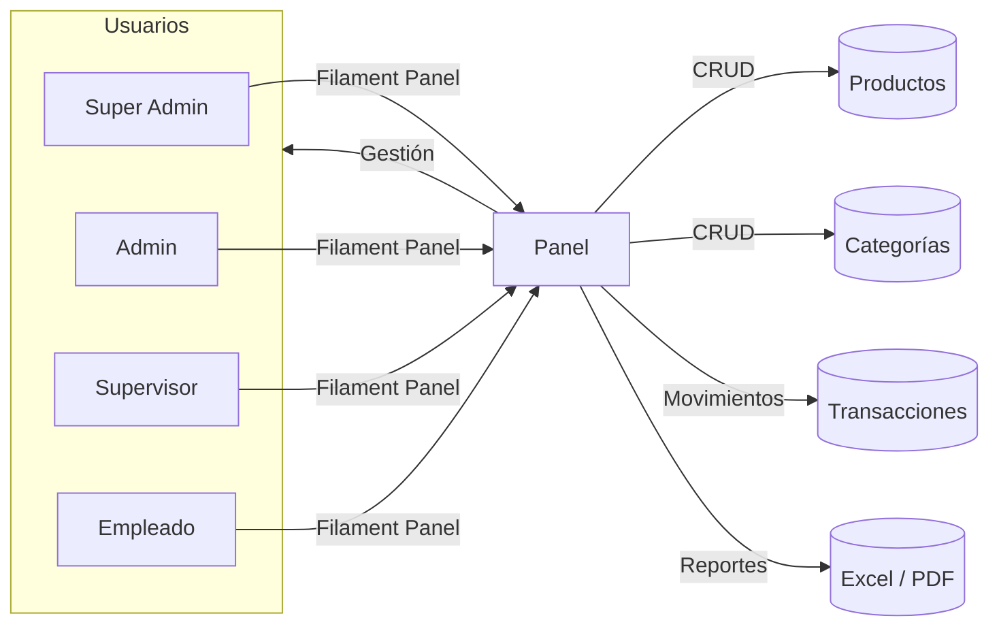
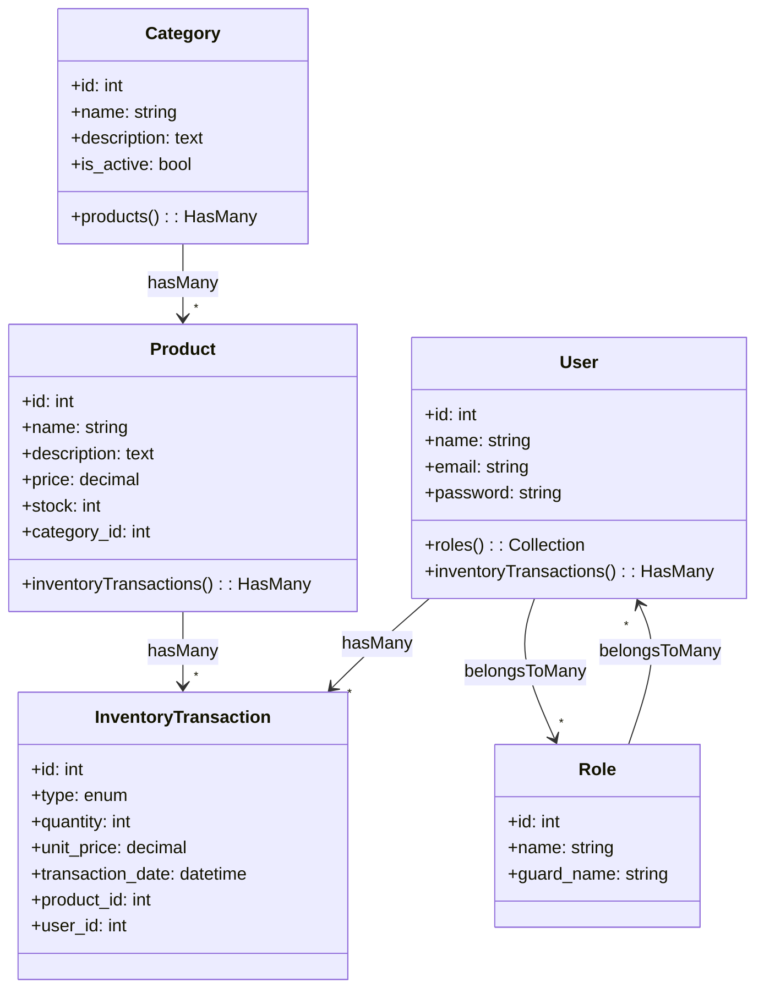
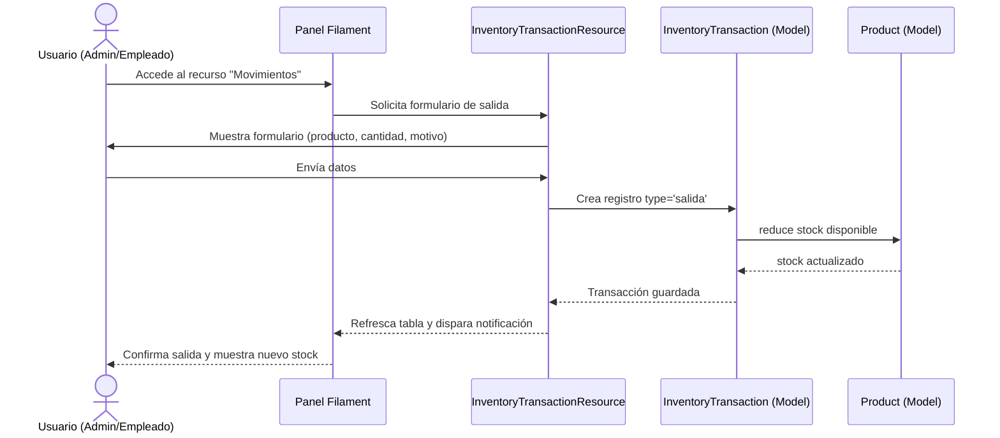
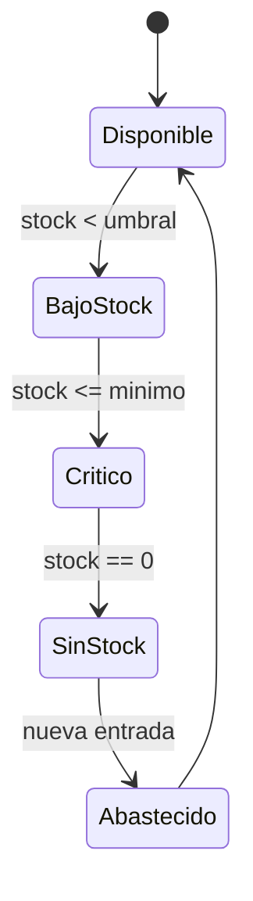

# Diagramas UML

Representaciones en formato Mermaid para visualizar las piezas construidas y planificadas.

## 1. Diagrama de contexto

## 2. Diagrama de clases

## 3. Secuencia – Registro de una salida de inventario

## 4. Diagrama de estados – Producto

Estos diagramas deben actualizarse al incorporar nuevos módulos o relaciones.
