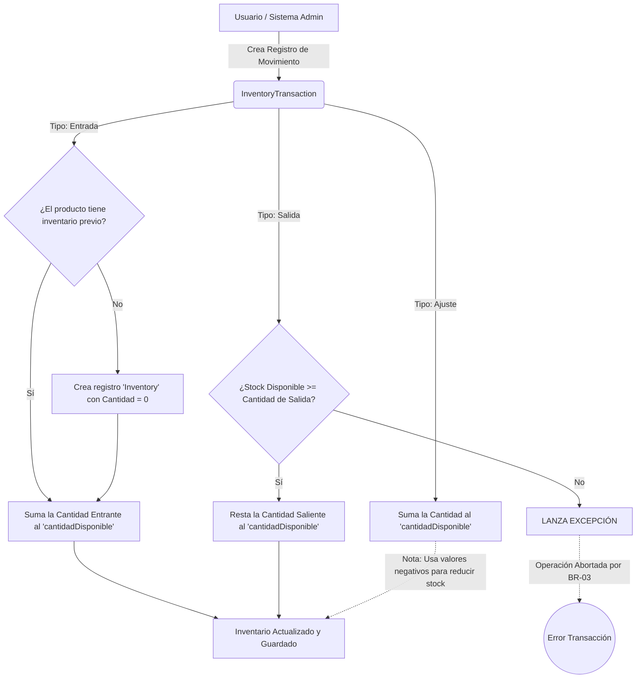
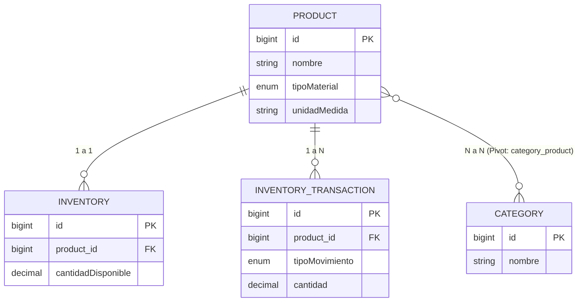

# Documentación de Pruebas y Flujos de Inventario

Este documento detalla los flujos de información del módulo de inventario y los casos de prueba unitarios desarrollados para garantizar la integridad y consistencia de los datos del sistema GAAF UDI.

## 1. Diagramas de Flujo

### 1.1 Flujo de Movimientos de Inventario (Entradas, Salidas y Ajustes)

El siguiente diagrama detalla cómo el sistema gestiona las reglas de negocio (BR-02, BR-03, BR-04) a nivel de la base de datos y modelos, asegurando que ninguna transacción de Filament UI (o externa) pueda quebrantar las existencias.



### 1.2 Flujo de Relación Material-Categoría

Este diagrama explica cómo un material puede estar clasificado en múltiples categorías de acuerdo con los requerimientos (RF-01).



---

## 2. Documentación de Tests Automatizados

Para garantizar la inmutabilidad y el correcto cálculo matemático del inventario, se implementó una suite de pruebas en **`tests/Feature/InventoryTest.php`**.

### Comando para Ejecutar las Pruebas
Para ejecutar las pruebas y validar el entorno, puedes correr el siguiente comando en la terminal:
```bash
php artisan test --filter InventoryTest
```

### Casos de Uso Evaluados e Implementados

#### 2.1. Creación de Materiales y Categorías Múltiples (`test_can_create_material_and_assign_categories`)
*   **Propósito:** Validar que un material puede pertenecer a más de una categoría de forma simultánea.
*   **Proceso:** Crea un `Product` virtual, dos `Category`, y los vincula. Finalmente, afirma (`assertCount`) que el producto está enlazado a ambas categorías exitosamente.

#### 2.2. Aumento de Stock por Entradas (`test_inventory_increases_on_entrada`)
*   **Propósito:** Validar la regla **BR-04** (Actualización automática de entradas).
*   **Proceso:** Se inyecta un nuevo registro de tipo `Entrada` en la tabla `InventoryTransaction` por `100.50` unidades. Se aserta que la tabla `Inventory` se crea sola y registra un stock final exacto de `100.50`.

#### 2.3. Reducción de Stock por Salidas (`test_inventory_decreases_on_salida`)
*   **Propósito:** Validar la regla **BR-04** (Actualización automática de salidas).
*   **Proceso:** Se crea una `Entrada` virtual de `200`. Luego se crea una `Salida` virtual de `50`. Matemáticamente se afirma que el stock resultante en `Inventory` es de `150`.

#### 2.4. Prevención de Salidas sin Stock (`test_inventory_prevents_salida_when_insufficient_stock`)
*   **Propósito:** Validar la regla crítica **BR-03** (Control de inventario disponible).
*   **Proceso:** El sistema intenta registrar una `Salida` de `10` unidades de un material con stock `0`. El test configura Laravel para esperar un "Choque" o Excepción (`$this->expectException(...)`). Si la excepción "La cantidad solicitada supera el inventario disponible" ocurre y aborta el proceso, **el test es exitoso**.

#### 2.5. Ajustes de Inventario Relativos (`test_inventory_updates_on_ajuste`)
*   **Propósito:** Validar soporte transaccional para correcciones.
*   **Proceso:** Alimenta un movimiento tipo `Ajuste` y confirma que la entidad de inventario se afecta con la misma corrección.
